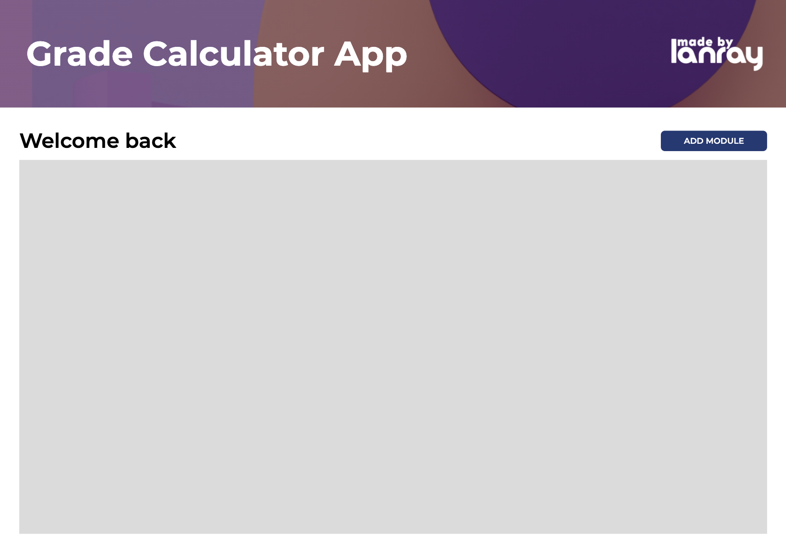

###Languages used
This project was coded in entirely in HTML5, CSS3 & Vanilla Javascript.

# Grade Calculator App

## Table of contents

- [Overview](#overview)
  - [The challenge](#the-challenge)
  - [Links](#links)
  - [Author](#author)
  - [Screenshot](#screenshot)
- [My process](#my-process)
  - [Built with](#built-with)
  - [What I learned](#what-i-learned)
  - [Continued development](#continued-development)
  - [Useful resources](#useful-resources)
- [Acknowledgments](#acknowledgments)

## Overview

### The challenge

The challenge is to create a grade calculator that gives you feedback on your current grades.

Users should be able to:

- Add modules for each of their university modules in university.
- Delete modules.
- Add assessements to each module.
- Delete assessements from specified module.
- Get detailed and accurate feedback about a module.

### Links

- Live Site URL: [Click here](https://lanrayy.github.io/grade-calculator/)

### Author

- Website - [Lanre Sodeinde](https://lanrayy.github.io/portfolio/)
- GitHub - [@Lanrayy](https://www.github.com/Lanrayy)
- Frontend Mentor - [@Lanrayy](https://www.frontendmentor.io/profile/Lanrayy)

### Screenshot



## My process

### Built with

- Semantic HTML5 markup
- CSS custom properties
- Flexbox
- Mobile-first workflow

### What I learned

I will use this section to recap over some of my major learnings while working through this project. Writing these out and providing code samples of areas I want to highlight is a great way to reinforce my own knowledge.

#### 1 . Object Oriented Programming

I learnt how to properly use object oriented progrogramming and classes. Without exploring this style of programming, I beleive this project would be very difficult or maybe impossoble. OOP enabled me to think of the assessments and modules as individual objects, which possess properties such as names, scores, marks etc. This significantly sped up the progress I made in this proejct.

```js
class assessment {
  constructor(name, yourScore, totalMarks, worth) {}
}
```

Adding modules & Deleting modules
Adding and deleting modules was a

#### 2. Adding and deleting modules/assessments individual assessments.

For example, if the user wanted to delete assessement 2, without affecting assessment 1 or 3.

Figuring out how to add and delete assessments took the longest amount of time. The problem was that I there was no way to differentiate between indivudual modules and similarly no way to differentiate between individual assessments.

My solution: To differentiate between modules, I created an empty object, which stored all the module objects and inside each module object, was an assessment object, which stored the assessments for each module.

```js
//Stores list of modules
let modulesList = {};

class modules{
    constructor(name, moduleCode, numofAssessments, credits){
        this.name = name;
        this.moduleCode = moduleCode;
        this.numOfAssessments = numofAssessments;
        this.average = this.calcAverage;
        this.credits = credits;
        // an object containing assessment objects;
        this.assessments = {};
    };
```

Advantages:

- This gave me the advantage of being able to query all the modules for their details.
- Additionally, When an assesment is deleted it did not affect the other modules.
- Using a for in loop on the object, meant that users can freely delete modules/assessment without the order playing a part or affecting the results.

#### 4. Module Feedback

Using JavaScript, I was able to create a working feedback system. When a user clicks for feedback on the module, the details of the corresponding object is displayed to the user in a popup.

I learnt how to use query selectors properly and how to manipulate the DOM better.

### Continued development

I am using this section to outline areas that I want to continue focusing on in future projects. These could be concepts I'm still not completely comfortable with or techniques you found useful that you want to refine and perfect.

I would like to explore with advanced HTML5 features.
I would also like to explore more advanced Javascript such as for of loops.
Expriment with more built in JavaScript methods.
Currently, if a user refreshed the page, all the entered information is deleted so I would like to explore more of that.

### Useful resources

- [Internetting is hard](https://www.internetingishard.com) - This helped with HTML & CSS.
- [W3Schools](https://www.w3schools.com) - Amazing resources for front end web developement
- [Udemy Javacript Zero to Hero](https://www.udemy.com/course/the-complete-javascript-course/learn/lecture/22648473?start=540#overview) - Great course to teach your from the basics to advanced Javascript features.

## Acknowledgments

This is where you can give a hat tip to anyone who helped you out on this project. Perhaps you worked in a team or got some inspiration from someone else's solution. This is the perfect place to give them some credit.
